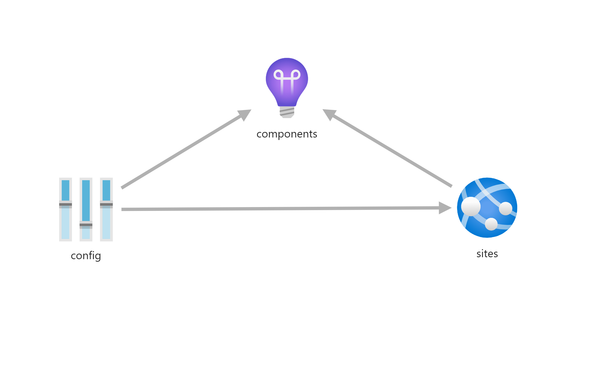

# App

Creates a web application. Parameters:

| Parameter                         | Type   | Required | Description                                                    |
|-----------------------            |--------|----------|----------------------------------------------------------------|
| webAppName                        | String | Yes      | The name of the web application                                |
| location                          | String | No       | The resource location                                          |
| tags                              | Object | Yes      | The list of tags for the application                           |
| appserviceResourceId              | String | Yes      | The ID of the app service plan the app runs on                 |
| containerRegistryName             | String | Yes      | The name of the container registry that holds the docker image |
| containerImageName                | String | No       | The docker image name to run (default application name)        |
| containerImageTag                 | String | Yes      | The docker image tag                                           |
| appGatewayIp                      | String | Yes      | Ip address the security restriction is valid for               |
| appCommandLine                    | String | No       | Command to run on container startup (entry_point.sh)           |
| allowedCorsOrigins                | Array  | No       | List of allowed sites for cross origin requests                |
| acrResourceGroup                  | String | No       | Specify if container registry is in another resource group     |
| environmentVariables              | Array  | Yes      | A list of environment variables for the web app                |
| publicNetworkAccess               | String | No       | Enabled or Disabled. Defaults to 'Disabled'                    |
| supportCredentials                | Bool   | No       | A list of environment variables for the web app                |
| azureStorageAccounts              | Object | No       | A list of storag accounts                                      |
| healthCheckPath                   | String | No       | A path for the healthprobe. e.g. '/ping'                       |
| http20Enabled                     | Bool   | No       | Whether http2.0 is allowed. Default to true                    |
| numberOfWorkers                   | Int    | No       | The number of workers or instances.                            |
| webSitesPort                      | Int    | No       | The website port exposed by the docker container. Default 8080 |
| ouboundVnetName                   | String | No       | Name of vnet to integrate for outbound connections             |
| outboundVnetConnectionName        | String | No       | Name of vnet-connection to integrate for outbound connections  |
| outboundSubnetName                | String | No       | The subnet name for the vnet connection                        |
| outboundVnetSubnetId              | String | No       | The subnet id for the vnet connection                          |
| privateEndpointName               | String | No       | The private endpoint name. Used for inbound connections        |
| privatelinkVnetName               | String | No       | The vnet to connect to the private endpoint                    |
| privatelinkVnetResourceGroupName  | String | No       | The resource-group hosting the privatelink vnet                |
| privatelinkSubnetName             | String | No       | The vnet subnet name for the privte endpoint                   |
| privateDnsZoneId                  | String | No       | The private dns-zone id for name resolution                    |
| dnsZoneGroupName                  | String | No       | A dns-zone groupname                                           |
| privateDnsZoneGroupConfigName     | String | No       | A dns-zone group configuration name                            |


## Creating web app with private endpoint and outbound vnet integration

```
// parameters up here ...

resource privateDnsZone 'Microsoft.Network/privateDnsZones@2024-06-01' existing = {
  name: 'privatelink.azurecloud.azurewebsites.net'
  scope: resourceGroup(resourceGroupName)
}

module myApp 'br/CoreModulesDEV:webapp:1.5' = {
  name: '${appname}.deploy'
  params: {
    webAppName: apiAppName
    appserviceResourceId: resourceId('Microsoft.Web/serverfarms', appPlanName)
    containerRegistryName: apRegistryName
    containerImageName: apAppName
    containerImageTag: imgTagToDeploy
    allowedCorsOrigins: [
      'http://localhost:5001'
      'http://localhost:3000'
    ]
    webSitesPort: 80
    supportCredentials: corsSupportCredentials
    publicNetworkAccess: 'Enabled'
    appGatewayIp: appgwpip
    numberOfWorkers: numberOfWorkers
    http20Enabled: true
    healthCheckPath: '/ping'
    privateEndpointName: privateEndpointName
    privatelinkVnetResourceGroupName: portalResourceGroupName
    privatelinkVnetName: portalVnetName
    privatelinkSubnetName: appInboundSubnetName
    vnetName: portalVnetName
    virtualNetworkSubnetId: resourceId(portalResourceGroupName, 'Microsoft.Network/virtualNetworks/subnets', portalVnetName, appOutboundSubnetName)
    privateDnsZoneId: privateDnsZone.id
    dnsZoneGroupName: 'dns-group1'
    privateDnsZoneGroupConfigName: 'group-config1'
    subnetName: appOutboundSubnetName
    environmentVariables: [
      {
        name: 'ENVIRONMENT'
        value: env
      }
      {
        name: 'INSIGHT_CONNECTION_STRING'
        value: appInsightsConnectionStr
      }
    ]
    tags: {
      Component: tagComponent
      Environment: tagEnvironment
    }
  }
}
```

## Creating a web app with application insights
To create an application connected to an application insights instance, refer to this example for passing the
application insights key to the app.

```json
{
    "type": "Microsoft.Resources/deployments",
    "apiVersion": "2019-10-01",
    "name": "[variables('appInsightsDeploymentName')]",
    "properties": {
        "mode": "Incremental",
        "templateLink": {
            "uri": "https://raw.githubusercontent.com/equinor/ioc-shared-infrastructure/master/resources/resourceAppInsights/azuredeploy.jsonc",
            "contentVersion": "1.0.0.0"
        },
        "parameters": {
            "appInsightsName": {
                "value": "[variables('appInsightsName')]"
            },
            "workspaceResourceId": {
                "value": "[variables('workspaceResourceId')]"
            },
            "ingestionMode": {
                "value": "[variables('ingestionMode')]"
            },
            "tags": {
                "value": {
                    "Environment": "[parameters('environment')]"
                }
            }
        }
    }
},
{
    "type": "Microsoft.Resources/deployments",
    "apiVersion": "2019-10-01",
    "name": "[variables('webappBeDeploymentName')]",
    "dependsOn": [
        "[concat('almond_plan_', parameters('environment'))]", // App service plan
        "[variables('appInsightsDeploymentName')]"
    ],
    "properties": {
        "mode": "Incremental",
        "templateLink": {
            "uri": "https://raw.githubusercontent.com/equinor/ioc-shared-infrastructure/master/resources/resourceApp/azuredeploy.jsonc",
            "contentVersion": "1.0.0.0"
        },
        "parameters": {
            "webAppName": {
                "value": "[variables('webappBeName')]"
            },
            "tags": {
                "value": {
                    "Environment": "[parameters('environment')]"
                }
            },
            "appserviceResourceId": {
                "value": "[resourceId('Microsoft.Web/serverfarms',concat('s039-ioc-almond-plan-',parameters('environment')))]"
            },
            "containerRegistryName": {
                "value": "[variables('registryName')]"
            },
            "containerImageName": {
                "value": "almondbe"
            },
            "containerImageTag": {
                "value": "[parameters('containerImageTag')]"
            },
            "acrResourceGroup": {
                "value": "S039-ioc-almond-rg-dev"
            },
            "appCommandLine": {
                "value": "./entry_point.sh"
            },
            "allowedCorsOrigins": {
                "value": [
                    "http://localhost:5001",
                    "[variables('portalUrl')",
                    "[concat('https://s039-ioc-almondfe-app-', parameters('environment'), '.azurewebsites.net')]"
                ]
            },
            "environmentVariables": {
                "value": [
                    {
                        "name": "INSIGHT_INSTRUMENTATION_KEY",
                        "value": "[reference(variables('appInsightsDeploymentName')).outputs.instrumentationKey.value]",
                        "slotSetting": false
                    },
                ]
            },
            "appGatewayIp": {
                "value": "Any"
            }
        }
    }
},
```



