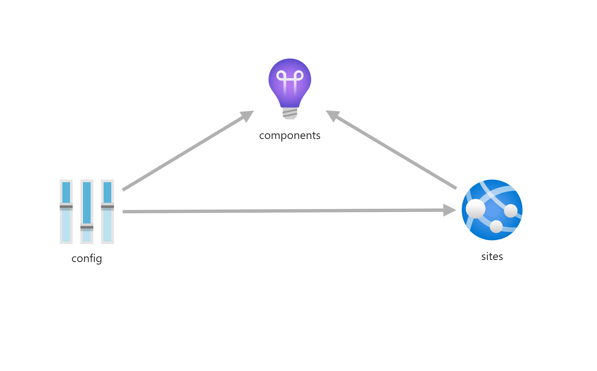

# App

Creates a web app for use with docker compose. It includes a connected ApplicationInsights instance.




## Example usage

Using PowerShell, you can read and convert the docker-compose.yaml to base64 and pass this into your template

```powershell

$Base64 = [System.Convert]::ToBase64String([System.IO.File]::ReadAllBytes('.\docker-compose.yaml'));
New-AzResourceGroupDeployment -ResourceGroupName  $resourceGroupName `
  -TemplateFile  "azuredeploy.jsonc" `
  -TemplateParameterFile "azuredeploy.parameters.test.jsonc" `
  -dockerComposeYaml $Base64


```

## Example parameter file

``` json
{
    "$schema": "https://schema.management.azure.com/schemas/2019-04-01/deploymentParameters.json#",
    "contentVersion": "1.0.0.0",
    "parameters": {
        "webAppName": {
            "value": "myWebApp"
        },
        "appserviceResourceId": {
            "value": "00000-000-000-0000"
        },
        "containerRegistryName": {
            "value": "myContainerRegistry"
        },
        "dockerComposeYaml": {
            "value": "BASE64_ENCODED_DOCKER_COMPOSE"
        },
        "tags": {
            "value": {
                "Environment": "[parameters('environment')]"
            }
        },
        "environmentVariables": {
            "value": [
                {
                    "name": "SomeEnvVar1",
                    "value": "SomeValue",
                    "slotSetting": false
                },
                {
                    "name": "SomeEnvVar2",
                    "value": "SomeValue2",
                    "slotSetting": false
                }
            ]
        },
    }
}
```
