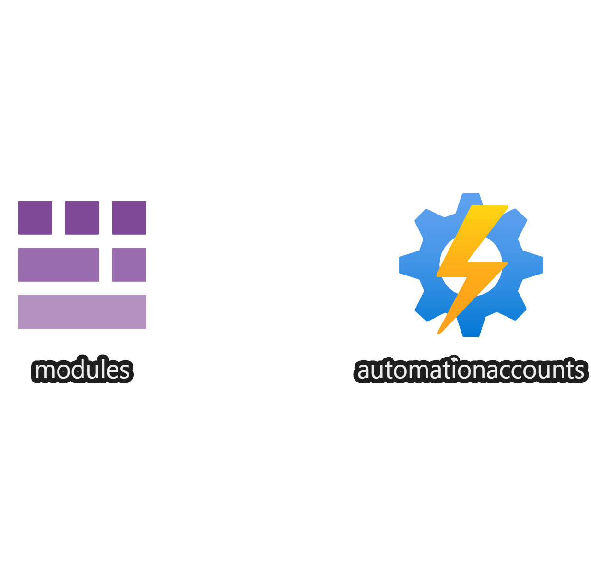

# Azure automation account

This template can be used to create an Azure Automation Account.



## Template parameters

| Parameter name           | Type   | Required | Value                                                                             |
|--------------------------|--------|----------|-----------------------------------------------------------------------------------|
| automationAccountName    | string | Yes      | The name of the automation account                                                |
| location                 | string | Yes      | The location of the automation account.                                           |
| tags                     | object | No       | The standard for resource tags                                                    |
| automationAccountModules | array  | No       | The modules required for running jobs/runbooks for eksample for analysis services |

## Example usage

``` ps
az deployment group create --mode Incremental --name myAutomationAccountDeployment --resource-group myResourceGroup --template-file ./azuredeploy.json --template-uri "https://raw.githubusercontent.com/equinor/ioc-shared-infrastructure/master/resources/resourceAutomationAccount/azuredeploy.jsonc"
```

## Example parameter file

``` json
{
    "$schema": "https://schema.management.azure.com/schemas/2019-04-01/deploymentParameters.json#",
    "contentVersion": "1.0.0.0",
    "parameters": {
        "automationAccountName": {
            "value": "myautomationAccoountName"
        },
        "tags": {
            "value": {
                "Tag1": "Value1", 
                "Tag2": "Value2"
            }
        },
        "automationAccountModules": {
            "value": [
                {
                    "name": "module.01",
                    "version": "0.0.0"
                },
                {
                    "name": "module.02",
                    "version": "0.0.0"
                }
            ]
        }
    }
}
```