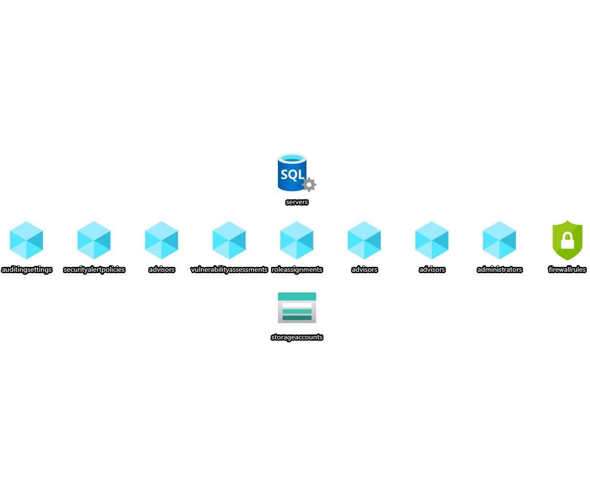

# Azure SQL

This template can be used to create a single Azure SQL resources with a storage account that stores audit log and vulnerability assessments.



## Template parameters

| Parameter name                                  | Type         | Required | Value                                                                                                                                                 |
|-------------------------------------------------|--------------|----------|-------------------------------------------------------------------------------------------------------------------------------------------------------|
| sqlServerName                                   | string       | Yes      | The name of the SQL logical server.                                                                                                                   |
| sqlServerAdministratorLogin                     | string       | Yes      | The administrator login of the logical SQL server.                                                                                                    |
| sqlServerAdministratorLoginPassword             | securestring | Yes      | The administrator login password of the logical SQL server.                                                                                           |
| storageAccountName                              | string       | Yes      | The name of the storage account used by the Azure SQL.                                                                                                |
| sqlActiveDirectoryAdmin                         | string       | Yes      | The active directory admin of the SQL Server. This can be either a user og group                                                                      |
| sqlActiveDirectoryAdminSid                      | string       | Yes      | The object id of the active directory admin. This can be found in Azure Active Directory.                                                             |
| sqlActiveDirectoryAdminTenant                   | string       | No       | The tenant of the active directory admin. Defaults to the tenant of the subscription.                                                                 |
| sqlFirewallIpRules                              | array        | No       | Object containing all the IP exceptions to add in the firewall.                                                                                       |
| sqlSecurityAlertPoliciesNotificationEmails      | array        | No       | The receivers of security alerts on the sql server.                                                                                                   |
| sqlVulnerabilityAssessmentNotificationReceivers | array        | No       | The receivers of results generated by the vulnerability scans on the sql server.                                                                      |
| isStorageBehindVnet                             | bool         | No       | Enable Auditing to storage behind Virtual Network or firewall rules. The user deploying the template must have an administrator or owner permissions. |
| location                                        | string       | No       | Location for all resources within this template. Defaults to the resource group location.                                                             |
| tags                                            | object       | No       | The tags to append on each resource created.                                                                                                          |

## Example usage

``` ps
az deployment group create --mode Incremental --name myAzureSqlDeployment --resource-group myResourceGroup --template-file ./azuredeploy.json --template-uri "https://raw.githubusercontent.com/equinor/ioc-shared-infrastructure/master/resources/resourceAzureSql/azuredeploy.jsonc"
```

## Example parameter file

``` json
{
    "$schema": "https://schema.management.azure.com/schemas/2019-04-01/deploymentParameters.json#",
    "contentVersion": "1.0.0.0",
    "parameters": {
        "sqlServerName": {
            "value": "mySqlServerName"
        },
        "sqlServerAdministratorLogin": {
            "value": "mySqlServerAdministratorLogin"
        },
        "sqlServerAdministratorLoginPassword": {
            "value": "mySuperSecretPassword"
        },
        "storageAccountName": {
            "value": "mystorageaccountname"
        },
        "tags": {
            "value": {
                "Environment" : "Dev"
            }
        },
        "sqlActiveDirectoryAdmin": {
            "value": "myActiveDirectoryAdmin"
        },
        "sqlActiveDirectoryAdminSid": {
            "value": "someGuidValueHere"
        },
        "sqlFirewallIpRules": {
            "value": [
                {
                    "name": "AllowAllWindowsAzureIps",
                    "startIp": "0.0.0.0",
                    "endIp": "0.0.0.0"
                }
            ]
        },
        "sqlSecurityAlertPoliciesNotificationEmails": {
            "value": [
                "demo@demo.com"
            ]
        },
        "sqlVulnerabilityAssessmentNotificationReceivers": {
            "value": [
                "demo@demo.com",
            ]
        }
    }
}
```
