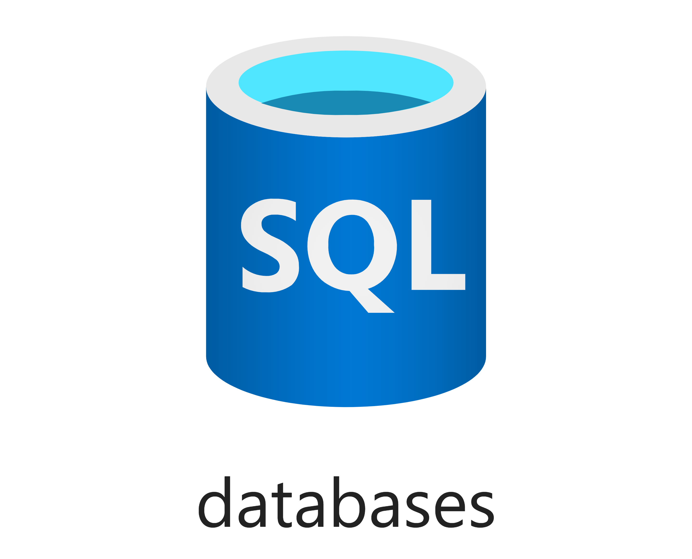

# Azure SQL Database

This template can be used to create a database on a target Azure SQL resource.



## Template parameters

| Parameter name    | Type   | Required | Value                                                                                                                                                                   |
|-------------------|--------|----------|-------------------------------------------------------------------------------------------------------------------------------------------------------------------------|
| sqlServerName     | string | Yes      | The name of the SQL logical server.                                                                                                                                     |
| databaseName      | string | Yes      | The name of the SQL database.                                                                                                                                           |
| databaseCollation | string | No       | The collation of the SQL database. Defaults to SQL_Latin1_General_CP1_CI_AS.                                                                                            |
| sku               | object | No       | The service tier of the database using the [sku object](https://docs.microsoft.com/en-us/azure/templates/microsoft.sql/2020-11-01-preview/servers/databases#sku-object) |

## Example usage

``` ps
az deployment group create --mode Incremental --name myAzureSqlDatabaseDeployment --resource-group myResourceGroup --template-file ./azuredeploy.json --template-uri "https://raw.githubusercontent.com/equinor/ioc-shared-infrastructure/master/resources/resourceAzureSqlDatabase/azuredeploy.jsonc"
```

## Example parameter file

``` json
{
    "$schema": "https://schema.management.azure.com/schemas/2019-04-01/deploymentParameters.json#",
    "contentVersion": "1.0.0.0",
    "parameters": {
        "sqlServerName": {
            "value": "mySqlServerName"
        },
        "databaseName": {
            "value": "myDatabase"
        },
        "sku": {
            "value": {
                "name": "Standard",
                "tier": "Standard",
                "capacity": 100
            }
        }
    }
}
```
