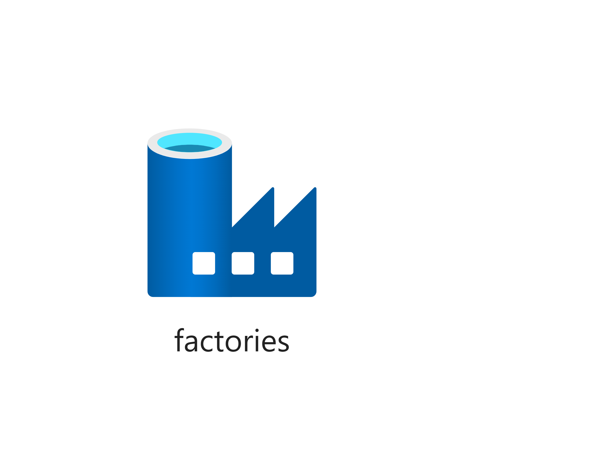

# Data Factory

This template can be used to create a Data Factory resource.



## Template parameters

| Parameter name   | Type         | Required | Value                                                                                     |
|------------------|--------------|----------|-------------------------------------------------------------------------------------------|
| dataFactoryName  | string       | Yes      | The name of the data factory.                                                             |
| repoConfiguraton | secureobject | No       | Must be configured if data factory is to be versioned.                                    |
| location         | string       | No       | Location for all resources within this template. Defaults to the resource group location. |
| tags             | object       | No       | The tags to append on each resource created.                                              |

## Example usage

``` ps
az deployment group create --mode Incremental --name myDataFactoryDeployment --resource-group myResourceGroup --template-file ./azuredeploy.json --template-uri "https://raw.githubusercontent.com/equinor/ioc-shared-infrastructure/master/resources/resourceDataFactory/azuredeploy.jsonc"
```

## Example parameter file

``` json
{
    "$schema": "https://schema.management.azure.com/schemas/2019-04-01/deploymentParameters.json#",
    "contentVersion": "1.0.0.0",
    "parameters": {
        "dataFactoryName": {
            "value": "myDataFactoryName"
        },
        "tags": {
            "value": {
                "Environment" : "Dev"
            }
        },
        "repoConfiguration": {
            "value": {
                "accountName" : "myGitHubAccountName",
                "repositoryName" : "myGitHubRepositoryName",
                "collaborationBranch" : "master",
                "rootFolder" : "/",
                "type" : "FactoryGitHubConfiguration"
            }
        }
    }
}
```
