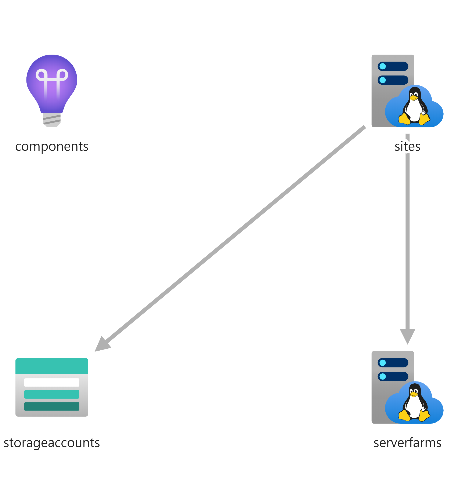

# Function App Windows

Combines a windows hosted function app, the storage account required for it, and a connected
ApplicationInsights instance.



## Template parameters

| Parameter name         | Type   | Required | Value                                                                                                                                                                   |
|------------------------|--------|----------|-------------------------------------------------------------------------------------------------------------------------------------------------------------------------|
| appServicePlanName     | string | Yes      | The name of the hosting plan.                                                                                                                                           |
| appServicePlanSku      | string | No       | The Name of AppServicePlan Sku <br/>"allowedValues": [ <br/>"S1", Standard <br/>"S2", Standard <br/>"S3", Standard <br/>"P1V2", Premium V2 <br/>"P2V2", Premium V2 <br/>"P3V2", Premium V2<br/>"Y1", Dynamic consumption plan<br/>]
| functionAppName        | string | Yes      | The name of the function app.                                                                                                                                           |
| storageAccountName     | string | Yes      | The name of the storage account used by the function(s).                                                                                                                |
| location               | string | No       | The name of the resource group. "defaultValue": "[resourceGroup().location]"                                                                                            |
| tags                   | object | Yes      | Tags that are associated with the resource. (https://docs.microsoft.com/en-us/azure/templates/microsoft.resources/tags)                                                 |
| appSettings            | array  | No       | The SiteConfig's appSettings of the functionApp   "defaultValue": [<br/>{<br/>"name": "FUNCTIONS_WORKER_RUNTIME",</br>"value": "python"<br/>},<br/>{<br/><br/>"name": "FUNCTIONS_EXTENSION_VERSION",<br/>"value": "~4"<br/>}]<br/><br/>Note:  appSettings must at least contains value for FUNCTIONS_WORKER_RUNTIME and FUNCTIONS_EXTENSION_VERSION


## Example usage

``` ps
az deployment group create --mode Incremental --name myFunctionAppDeployment --resource-group myResourceGroup --template-file ./azuredeploy.json --template-uri "https://raw.githubusercontent.com/equinor/ioc-shared-infrastructure/master/resources/resourceFunctionApp/azuredeploy.jsonc"
```

## Example parameter file

``` json
{
    "$schema": "https://schema.management.azure.com/schemas/2019-04-01/deploymentParameters.json#",
    "contentVersion": "1.0.0.0",
    "parameters": {
                    "appServicePlanName": {
                        "value": "MyAppServicePlanName"
                    },
                    "appServicePlanSku": {
                        "value":  "S1" 
                    },
                    "functionAppName": {
                        "value":  "MyFunctionAppName" 
                    },
                     "storageAccountName": {
                        "value": "MyStorageAccountName"
                    },                    
                    "location" : {
                        "value" : "myFunctionAppLocation"
                    },
                    "tags": {
                        "value": {
                                "Environment": "MyEnvironment",
                                "ServiceName": "MyServiceName",
                                "Team": "MyTeam",
                                "GeneratedBy": "[concat('myApp-', deployment().properties.template.contentVersion)]"            
                            },
                    
                    "appSettings": {
                        "value": [
                             {
                                "name": "FUNCTIONS_WORKER_RUNTIME",
                                "value": "python"
                             },
                             {
                               "name": "FUNCTIONS_EXTENSION_VERSION",
                               "value": "~2"
                            },
                            {
                                "name": "MyCustomAppsetting",
                                "value": "120d"
                            },            
                            ]
                                                                                                                   
                    }                
                }
    }
}
```
