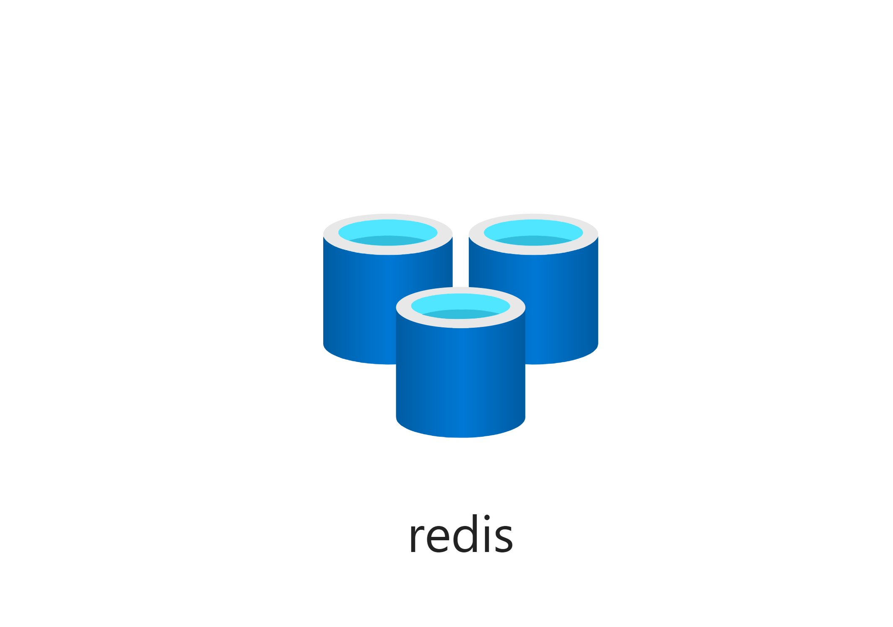

# Redis

Azure Redis Cache. Running with disabled non-ssl ports



## Template parameters

| Parameter name     | Type   | Required | Value                                                                                     |
|--------------------|--------|----------|-------------------------------------------------------------------------------------------|
| redisName          | string | Yes      | The name of the redis cache server.                                                       |
| sku                | object | No       | SKU for the redis cache                                                                   |
| redisConfiguration | object | No       | Redis configuration object. See https://docs.microsoft.com/en-us/azure/templates/microsoft.cache/2019-07-01/redis#rediscreateproperties-object |
| location           | string | No       | Location for all resources within this template. Defaults to the resource group location. |
| tags               | object | No       | The tags to append on each resource created.                                              |

## Bicep parameters

| Parameter name        | Type   | Required | Value                                                                                     |
|-----------------------|--------|----------|-------------------------------------------------------------------------------------------|
| redisName             | string | Yes      | The name of the redis cache server.                                                       |
| redisConfiguration    | object | No       | Redis configuration object. See https://docs.microsoft.com/en-us/azure/templates/microsoft.cache/2019-07-01/redis#rediscreateproperties-object |
| aadEnabled            | string | No       | If aad is enabled or not. Default is 'false'                                              |
| redisVersion          | string | No       | Version of the redis cache. Default is '6'                                                |
| redisCacheSKU         | string | No       | SKU for the redis cache. Default is 'Standard'. Must be at least 'Premium' if subnetId is used |
| redisCacheFamily      | string | No       | The sku family. Default is 'C'. Must be 'P'                                                            |
| redisCacheCapacity    | int    | No       | The size of the redis cache instance in terms Gb                                          |
| shardCount            | int    | No       | Number of shards. For Premium only. Defaults to 1                                         |
| subnetId              | string | No       |  |
| location              | string | No       | Location for all resources within this template. Defaults to the resource group location. |
| tags                  | object | No       | The tags to append on each resource created.                                              |


## Example usage

``` ps
az deployment group create --mode Incremental --name myRedisCacheDeployment --resource-group myResourceGroup --template-file ./azuredeploy.json --template-uri "https://raw.githubusercontent.com/equinor/ioc-shared-infrastructure/master/resources/resourceRedis/azuredeploy.jsonc"
```

## Example parameter file

``` json
{
    "$schema": "https://schema.management.azure.com/schemas/2019-04-01/deploymentParameters.json#",
    "contentVersion": "1.0.0.0",
    "parameters": {
        "redisName": {
            "value": "myRedisCache"
        },
        "tags": {
            "value": {
                "Environment" : "Dev"
            }
        },
        "sku": {
            "value": {
                "name": "Standard",
                "family": "C",
                "capacity": 1
            }
        },
        "redisConfiguration": {
            "value": {
                "maxclients": "1000",
                "maxmemory-reserved": "50",
                "maxfragmentationmemory-reserved": "50",
                "maxmemory-delta": "50"
            }
        }
    }
}
```

## Example subnetId
```
subnetId: resourceId(vnetResourceGroupName,'Microsoft.Network/virtualNetworks/subnets', vnetName, subnetName)
```
