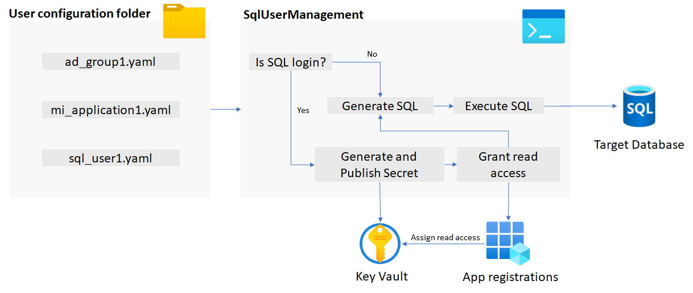

# SQL User Management module

The SQL User Management module is a PowerShell module you can use to ease the work of managing users in your Azure SQL databases.

## Architecture

The idea is that the module can be used in a DevOps pipeline (in the near future) to automate user management, but for many companies that is not possible yet before the Azure Active Directory [cloud groups](https://docs.microsoft.com/en-us/azure/active-directory/roles/groups-concept) concept is out of preview.

The module takes a directory as input and will read all available yaml user configuration files. Then the module will take some actions based on user type before generating the final sql statement that will be run against the targeted database.



As of now the following user objects is supported

- Creating SQL User with password. This require a Key Vault to store the secret, and that the application exists so that read permission to the Key Vault can be granted.
- Creating Active Directory Group as user of the database.
- Creating Managed Identity applications as user of the database.

## Before you start

### Download PowerShell 7

Please make sure that you have installed the newest version of PowerShell Core. Windows powershell will possibly cause the module execution to fail and is not recommended to use.

- Powershell Core can be found at [GitHub](https://github.com/PowerShell/PowerShell/releases).

When PowerShell Core is installed on your local machine, please install the [Azure Powershell](https://docs.microsoft.com/en-us/powershell/azure/install-az-ps?#install-for-current-user) module. The module is used for integration to Azure resources.

**Note!** Make sure that you are in a Powershell 7 terminal when executing the installation of the Azure PowerShell module.

### Connect to Azure

Before running the module make sure that you have connected to Azure. Please follow the documentation and choose the appropiate sign in method.

[https://docs.microsoft.com/en-us/powershell/module/az.accounts/connect-azaccount](https://docs.microsoft.com/en-us/powershell/module/az.accounts/connect-azaccount)

## How to use the module

### Importing the module

To use the SqlUserManagement module it must be imported.

The easies way to start using the module and to experiment is to clone this  GitHub repository, then import the module pointing at the current folder.

```ps
Import-Module drive:\your-folderpath\sqlUserManagement\SqlUserManagement -Force
```

### User configuration file

The module reads one or more YAML files. Beware that permissions defined for type object needs schema name included in targets.
The syntax is the following.

Definition:

```yaml
name: {login name}
format: {"{0}" | "{0}-{1}" | "{0}{1}"}
type: {active_directory_group | active_directory_app_registration | sql_login}
environments:
  - "<environment>:<environment_to_map_to>"
permissions:
  - type: {database | schema | object}
    targets:
      - {<table_name> | <schema_name> | all}
    grants:
      - <sql server grants>
roles:
  - <roles available at the database>
```

Example:

```yaml
name: mySqlLogin
format: "{0}{1}"
type: sql_login
environments:
  - "dev:dev"
  - "dev:test"
  - "test:test"
  - "prod:prod"
permissions:
  - type: schema
    targets:
      - dbo
      - myOtherSchema
    grants:
      - SELECT
  - type: object
    targets:
      - dbo.myTableName
      - myOtherSchema.myOtherTableName
    grants:
      - SELECT
      - INSERT
roles:
  - db_datareader
```

### Module Parameters

```sh
 -Environment <String>
    Environment to target. Typically dev, test and prod.
    Must match the environment mapping in the yaml file.

    Required?                    true
    Position?                    1
    Default value
    Accept pipeline input?       false
    Accept wildcard characters?  false

-ConfigurationPath <String>
    The path where the script should look for YAML files.

    Required?                    true
    Position?                    2
    Default value
    Accept pipeline input?       false
    Accept wildcard characters?  false

-KeyVaultName <String>
    The name of the KeyVault where the passwords for
    SQL logins will be stored.

    Required?                    true
    Position?                    3
    Default value
    Accept pipeline input?       false
    Accept wildcard characters?  false

-TargetServer <String>
    The SQL server the script should connect to.

    Required?                    true
    Position?                    4
    Default value
    Accept pipeline input?       false
    Accept wildcard characters?  false

-TargetDatbase <String>

    Required?                    true
    Position?                    5
    Default value
    Accept pipeline input?       false
    Accept wildcard characters?  false

-EnablePasswordRotation [<SwitchParameter>]
    Enable or disable password rotation. Default is
    to not perform password rotation.

    Required?                    false
    Position?                    named
    Default value                False
    Accept pipeline input?       false
    Accept wildcard characters?  false

-RotationDays <Int32>
    The number of days before rotating the password.

    Required?                    false
    Position?                    6
    Default value                -90
    Accept pipeline input?       false
    Accept wildcard characters?  false
```

### Running the module

```ps
Publish-DatabaseUsersAndPermissions 'dev' .\my-folder-for-user-permission\ myKeyVaultName myTargetSqlServer myTargetDatabase
```

## Todo's


